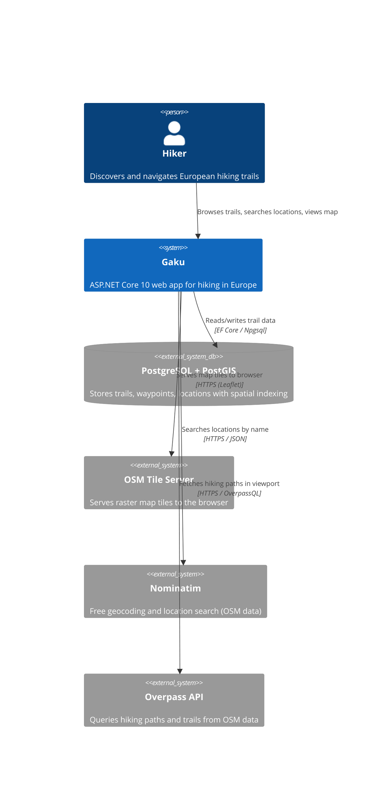
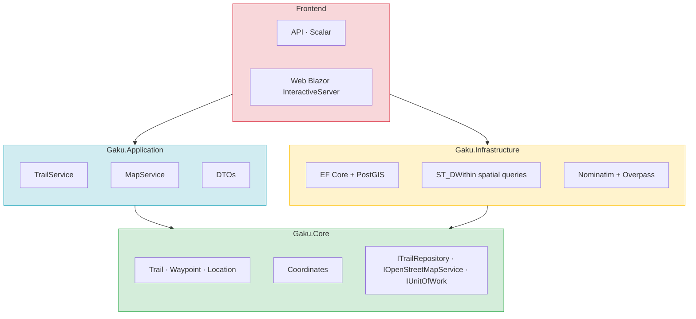
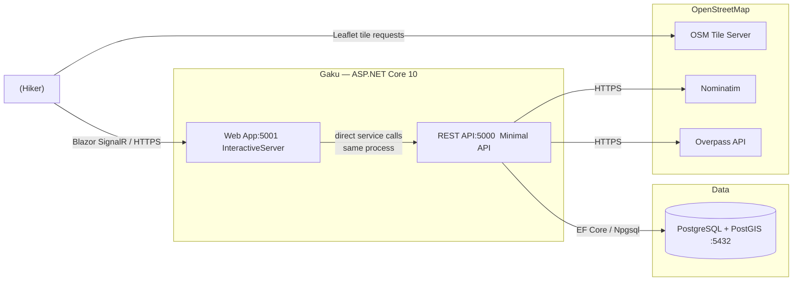
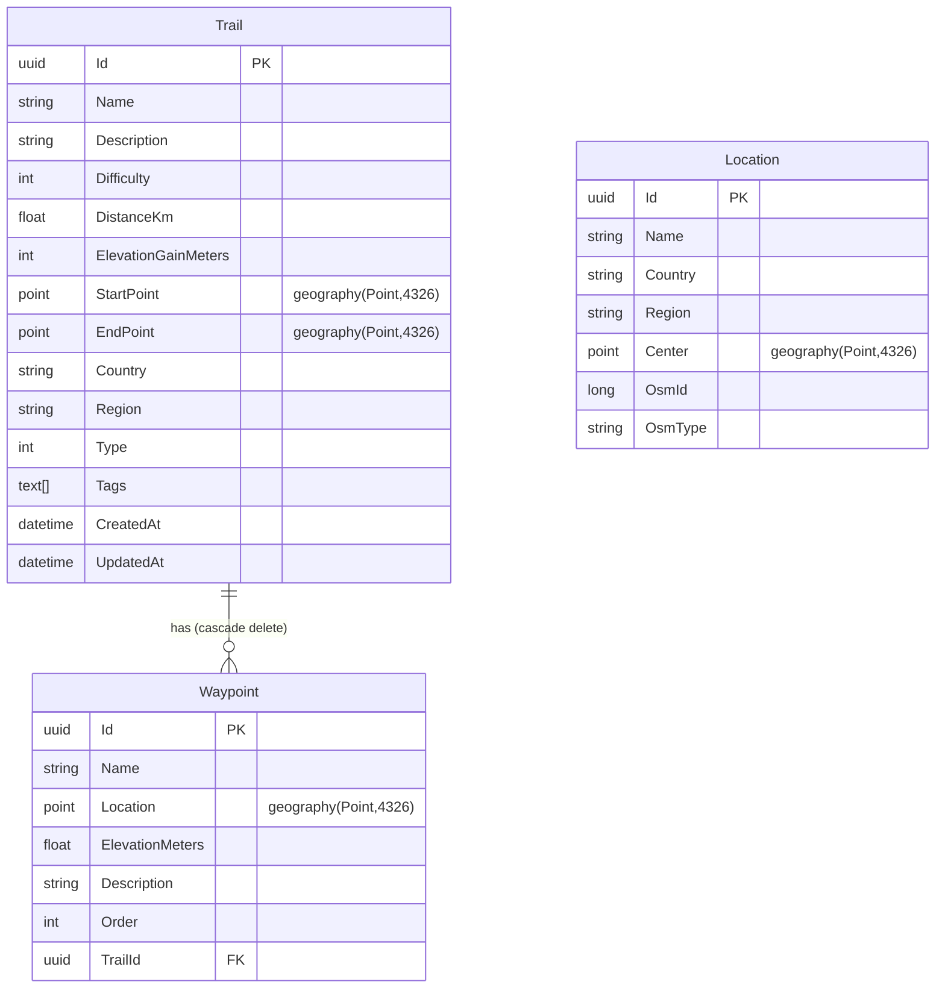
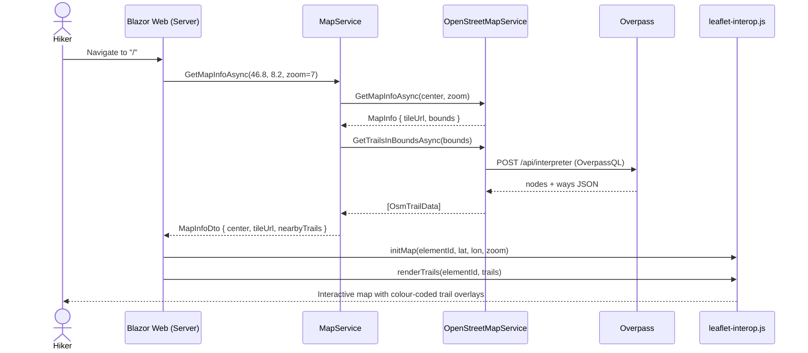

# Architecture Diagrams

Rendered by Mermaid

### System Context - Gaku

---

### Architecture

---

### Containers — runtime components and communication

---

### Entity Relationship — database schema

---

### Map Load Sequence — request flow when a hiker opens the map

