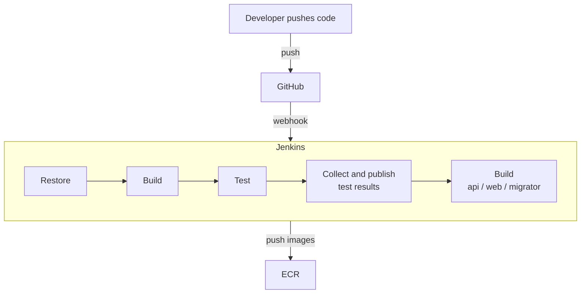
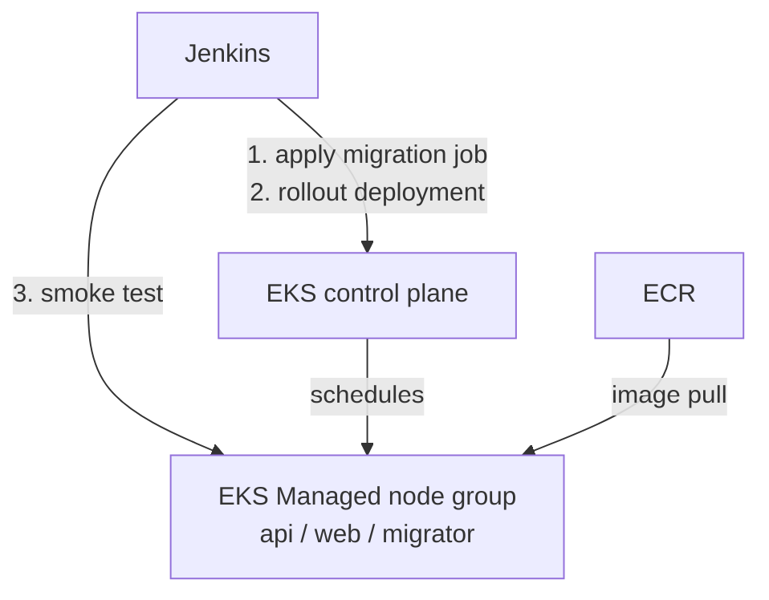

# AWS CI/CD Workflow

## 1. Overview

### 1.1 CI process - build, test, publish

CI is triggered by push of every branch.
CI works identically for staging and prod environment.

### 1.2 CD process - migrate, deploy, verify

CD is triggered by `master` branch.
`staging` environment.

| Component | Provisioned by | Purpose |
| --- | --- | --- |
| `gaku-staging` EKS cluster | `modules/eks` | Runs the deployed workloads in namespace `gaku` |
| AWS Load Balancer Controller | Helm, in-cluster | Turns the overlay's Ingress objects into a shared ALB |
| External Secrets Operator | Helm, in-cluster | Materialises `gaku-secret` from Secrets Manager |

---

