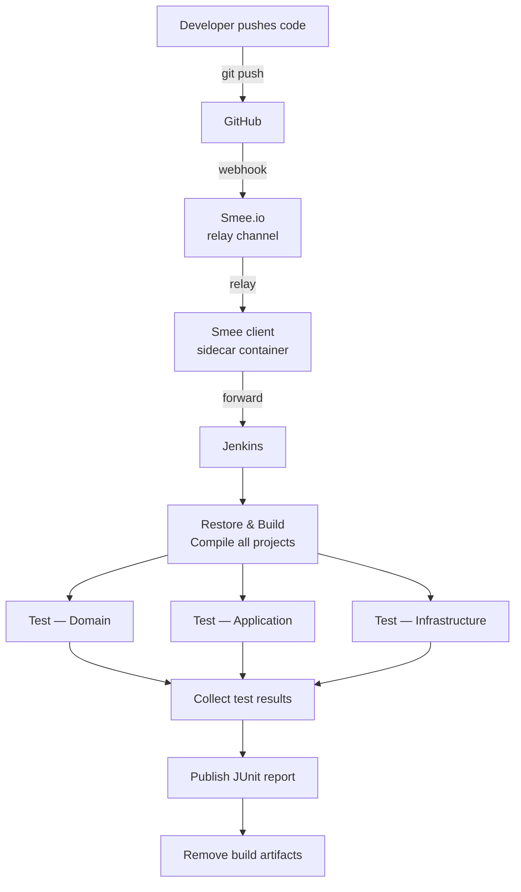
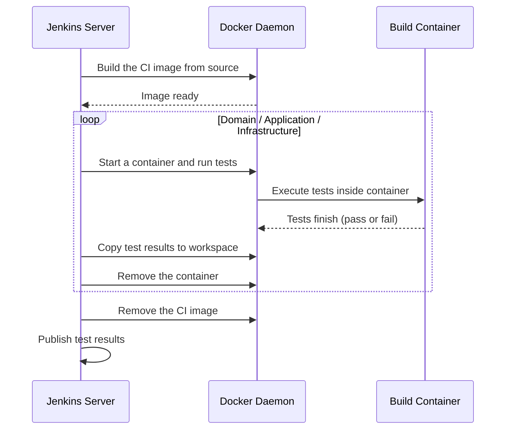

# Local-First CI/CD Workflow

## Overview



## Container Roles

| Container | Image | Purpose |
|---|---|---|
| `gaku-jenkins` | built from `jenkins/local/Dockerfile` | Jenkins server — hosts UI, schedules jobs, runs pipeline |
| `smee` | `node:lts-alpine` | Runs `smee-relay.js` — SSE client that forwards GitHub webhook payloads to Jenkins |
| `gaku-ci-<build>` | built from `docker/Dockerfile.ci` | Ephemeral per-build container — compiles and tests .NET code |

## Stage Detail



---

## Local CI Setup for Smee & Jenkins

Pipeline job config: Git push → `https://github.com/tuannamtruong/Gaku` → Webhook to Smee → Relay to Jenkins → Filter by branch `*/master` → script path `Jenkinsfile`.

### 1. Smee Channel

Go to [smee.io](https://smee.io) and get a new channel.
Save `SMEE_URL` in `jenkins/local/.env`
```
  SMEE_URL=https://smee.io/<your-channel-id>
```

### 2. GitHub Webhook

Register the Smee URL as a webhook in the GitHub repo
GitHub repo → Settings → Webhooks → Add webhook

| Field | Value |
|---|---|
| Payload URL | your Smee.io channel URL |
| Content type | `application/json` |
| Events | push event |

### 3. Jenkins

Start Jenkins and the Smee relay:

```bash
cd jenkins/local && docker compose up -d
```

Retrieve the initial admin password under 

```bash
docker exec gaku-jenkins cat /var/jenkins_home/secrets/initialAdminPassword
```

Open `http://localhost:8090`, log in, and install plugins: Pipeline, Git, GitHub, JUnit, Timestamper.


### 4. Pipeline Job Creation

Fetch crumb and save the session cookie

```
CRUMB=$(curl -s --cookie-jar /tmp/jenkins-cookies.txt \
"http://localhost:8090/crumbIssuer/api/json" \
--user "<username>:<password>" | grep -o '"crumb":"[^"]*"' | cut -d'"' -f4)
```

Create the job reusing the same session cookie
```
curl -X POST "http://localhost:8090/createItem?name=gaku" \
--user "<username>:<password>" \
--cookie /tmp/jenkins-cookies.txt \
--header "Content-Type: application/xml" \
--header "Jenkins-Crumb: $CRUMB" \
--data @job-config.xml
```

### 5. Verification

| Check | Command / Action |
|---|---|
| Smee relay is running | `docker logs smee` — should show SSE connected |
| Jenkins is reachable | `curl -s -o /dev/null -w "%{http_code}" http://localhost:8090` → `200` |
| Webhook delivery | Push a commit; GitHub repo → Settings → Webhooks → Recent Deliveries → `200` response |
| Pipeline triggered | Jenkins dashboard shows a new build for the pipeline job |


---

## Local CD Setup for minikube + K8s

Minikube install
https://minikube.sigs.k8s.io/docs/start/


Start cluster and enable ingress controller
```
  minikube start
  minikube addons enable ingress
```

Point Docker CLI at minikube's daemon
```
  eval $(minikube docker-env)
```

Build the projects with minikube context
```
  docker build -f docker/Dockerfile.Gaku.Api      -t gaku-api:latest      .
  docker build -f docker/Dockerfile.Gaku.Web      -t gaku-web:latest      .
  docker build -f docker/Dockerfile.Migrator      -t gaku-migrator:latest .
```

Re/apply the k8s infrastructure
```
  cp .env infra/k8s/local/.env
  kubectl apply -k infra/k8s/local/
  rm -f $(K8S_FOLDER).env
```

---
## File Map

```
jenkins/local/
  Dockerfile           custom Jenkins image
  docker-compose.yml   jenkins + smee
  smee-relay.js        pure Node.js SSE client; converts Smee payloads to JSON for Jenkins
  .env                 

docker/
  Dockerfile.ci        

Jenkinsfile            builds CI image, runs test containers, publishes JUnit results, removes image
```