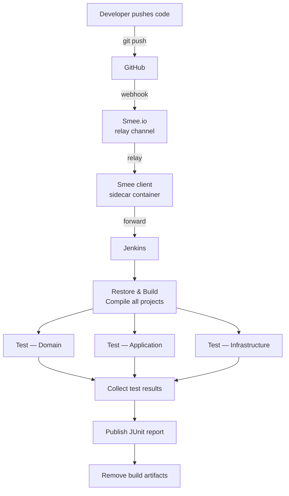
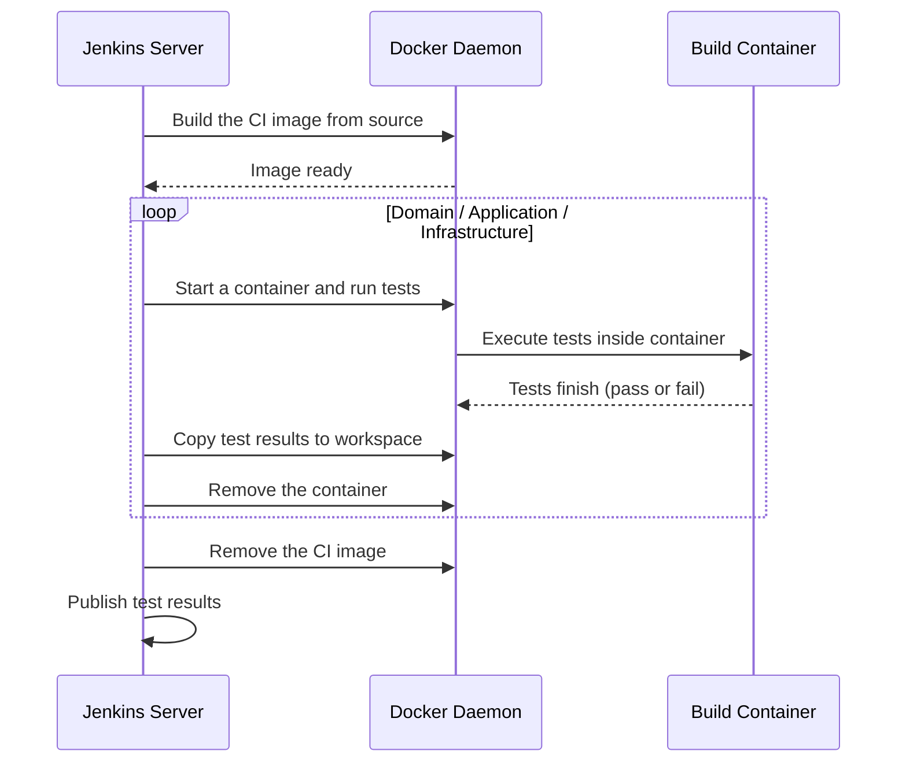

# CI/CD Workflow

## Overview



## Container Roles

| Container | Image | Purpose |
|---|---|---|
| `gaku-jenkins` | built from `jenkins/local/Dockerfile` | Jenkins server — hosts UI, schedules jobs, runs pipeline |
| `smee` | `node:lts-alpine` | Runs `smee-relay.js` — SSE client that forwards GitHub webhook payloads to Jenkins |
| `gaku-ci-<build>` | built from `docker/Dockerfile.ci` | Ephemeral per-build container — compiles and tests .NET code |

## File Map

```
jenkins/local/
  Dockerfile           custom Jenkins image (adds Docker CLI to jenkins/jenkins:lts-jdk21)
  docker-compose.yml   two services: gaku-jenkins + smee relay sidecar
  smee-relay.js        pure Node.js SSE client; no npm packages; converts Smee payloads to JSON for Jenkins
  .env                 single var: SMEE_URL=https://smee.io/<channel-id>  (not committed)

docker/
  Dockerfile.ci        multi-stage: stage build (restore + compile all projects), stage test (unused by Jenkinsfile — tests run via docker run on the build stage image)

Jenkinsfile            declarative pipeline — builds CI image, runs three test containers, publishes JUnit results, removes image
```

## Stage Detail


