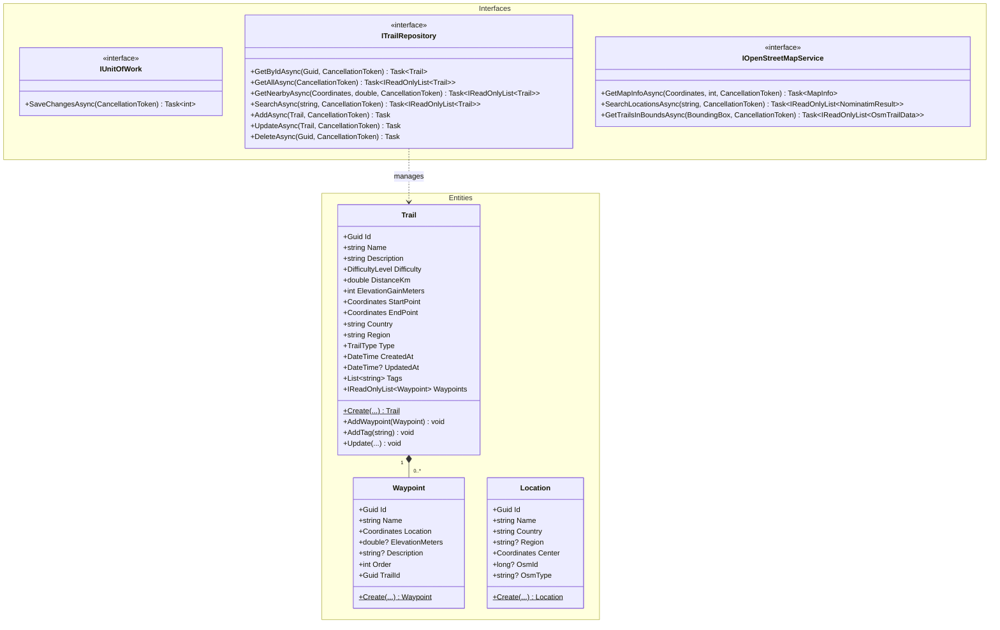
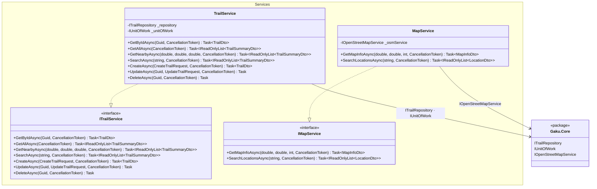
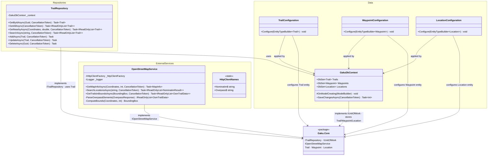

# Class Diagrams — Gaku

One diagram per project. Each project is the focal point — its own classes are shown in full detail.
External project dependencies appear as a single `<<package>>` node; arrows from internal classes point to that package, not to individual external classes.

---

## 1. Gaku.Core

No external project dependencies — innermost layer.

---

## 2. Gaku.Application

---

## 3. Gaku.Infrastructure

