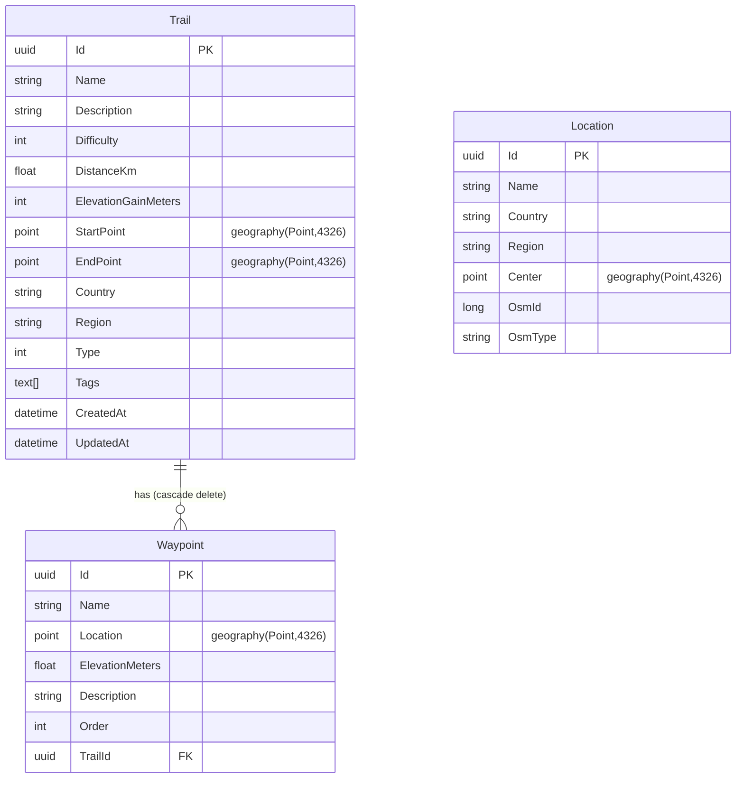

### Entity Relationship — database schema

```mermaid
erDiagram
  Trail {
    uuid     Id              PK
    string   Name
    string   Description
    int      Difficulty
    float    DistanceKm
    int      ElevationGainMeters
    point    StartPoint      "geography(Point,4326)"
    point    EndPoint        "geography(Point,4326)"
    string   Country
    string   Region
    int      Type
    text[]   Tags
    datetime CreatedAt
    datetime UpdatedAt
  }
  Waypoint {
    uuid   Id             PK
    string Name
    point  Location       "geography(Point,4326)"
    float  ElevationMeters
    string Description
    int    Order
    uuid   TrailId        FK
  }
  Location {
    uuid   Id      PK
    string Name
    string Country
    string Region
    point  Center  "geography(Point,4326)"
    long   OsmId
    string OsmType
  }

  Trail ||--o{ Waypoint : "has (cascade delete)"
```

---

