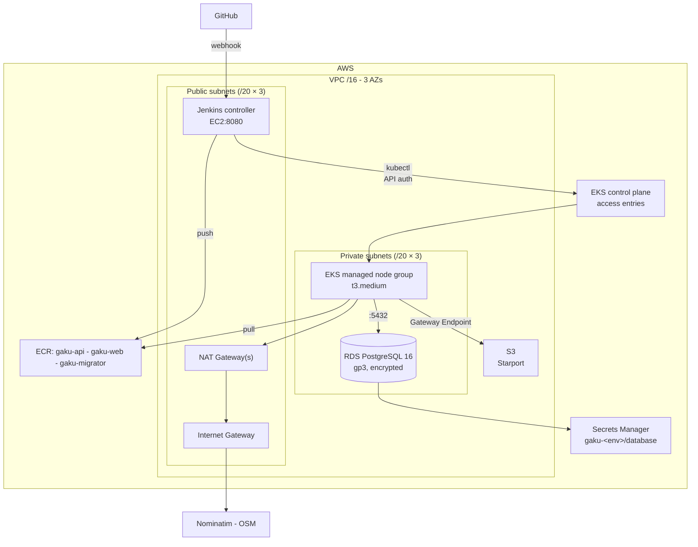
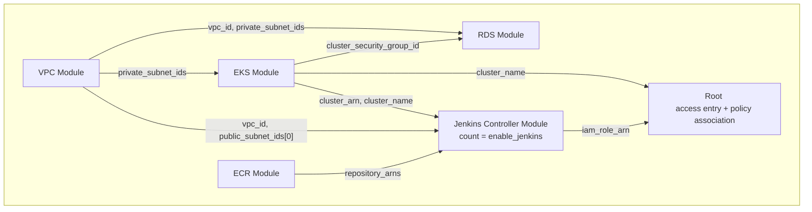

# Infrastructure - AWS

| `infra/terraform/*` | AWS Terraform. |
| --- | --- |
| `infra/terraform/README.md` | the same ground, next to the code |
| `infra/terraform/terraform.mk` | every `tf_*` target, including the bootstrap checklist text |
| `infra/terraform/bootstrap/README.md` | bootstrap apply and teardown detail |


## 1. Infrastructure Topology

Staging and production share the topology with different sizes ([§5 Environments](#5-environments)).




## 2. Dependency Graph



## 3. Apply

### 3.1 Bootstrap
```bash
# State bucket
make tf_bootstrap_init && make tf_bootstrap_plan && make tf_bootstrap_apply

# Verifies versioning, encryption, public access block, lifecycle
make tf_bootstrap_test
```

### 3.2 Staging

Check `terraform.tfvars`.

```bash
make tf_env_init ENV=staging    # Wires the backend from the bootstrap outputs
make tf_env_apply ENV=staging
```

### 3.3 Production

Production needs the staging controller's role to reach the production cluster:
`make tf_env_output ENV=staging | grep jenkins_role_arn`
Copy the ARN into production/terraform.tfvars as `external_deploy_role_arns`

```bash
make tf_env_init ENV=production
make tf_env_apply ENV=production
```

## 4. Module

### 4.1 vpc

The `/16` CIDR is split into `/20` blocks:
- 3 AZs
- 0–7: public subnet
- 8–10: private subnet

1 public and 1 private subnet are assigned to 1 AZ. The rests are reserved.

### 4.2 eks

Authentication from extern node to EKS control plane is through `API auth`.

Pod get AWS credentials by EKS Pod Identity addon.

### 4.3 rds

PostgreSQL 16 on gp3, encrypted, private, logs to CloudWatch. The parameter group sets `rds.force_ssl` and logs statements over one second. 
Pods reach Postgres through the EKS-managed security group.

### 4.4 ecr

`Staging` owns ECR and creates the repositories, which are used by all envs.

Repositories: `gaku-api`, `gaku-web`, `gaku-migrator`. 
- Tags are mutable
- Scanned on push
- Untagged image cleaned up in 7 days
- Max 30 images 


### 4.5 jenkins-controller

Instance for CICD process:
- Amazon Linux 2023 in a public subnet with an EIP
- Install: Corretto, Docker, Jenkins and `kubectl`,

Init log in `/var/log/cloud-init-output.log`.
Shell access is only thorugh Session Manager.
Jenkins gets cluster access from the environment root.

```bash
make tf_env_output ENV=staging          # unlock_command prints the full invocation
aws ssm start-session --target <instance-id>
sudo cat /var/lib/jenkins/secrets/initialAdminPassword
```

## 5. Environments

| | staging | production |
| --- | --- | --- |
| VPC CIDR | `10.0.0.0/16` | `10.1.0.0/16` |
| NAT gateways | 1, shared | 3, one per AZ |
| VPC flow logs | off | on, 14-day retention |
| EKS nodes | 2 × t3.medium, min 1 max 3 | 3 × t3.medium, min 2 max 6 |
| Control plane logs | api, authenticator | api, authenticator, audit |
| RDS | db.t4g.micro, 20–50 GiB, single-AZ | db.t4g.small, 50–200 GiB, multi-AZ |
| RDS backups | 1 day, no final snapshot | 14 days, final snapshot |
| Performance Insights | off | on |
| Deletion protection | off | on |
| ECR repositories | CRUD | read only |
| Jenkins | CRUD | read only |

## 6. Secrets

The RDS module generates a 32-character master password with `random_password` and writes it,
along with a ready-made Npgsql connection string, to a Secrets Manager entry named
`gaku-<env>/database`. The JSON keys match `infra/k8s/overlays/local/.env.k8s` exactly:

```
POSTGRES_DB  POSTGRES_USER  POSTGRES_PASSWORD  ConnectionStrings__DefaultConnection
```

plus `host` and `port`. A Phase 7 secret store can therefore map the entry onto `gaku-secret`
without renaming anything.

The connection string carries `SSL Mode=Require;Trust Server Certificate=true`, matching the
`rds.force_ssl` parameter. `Trust Server Certificate` skips CA validation — mounting the RDS CA
bundle into the images and dropping that flag is the stricter option, and worth doing before this
carries real data.

The password is in Terraform state, which is why the bucket in
[§3.1 Bootstrap](#31-bootstrap) is encrypted, versioned and blocked from public access. The
`aws_db_instance` ignores changes to `password`, so rotating it in AWS does not cause drift.

## 7. Verification

| Target | Checks |
| --- | --- |
| `make tf_validate_all` | Syntax check for each module and environment |
| `make tf_bootstrap_test` | Bootstrap state test |
| `make tf_env_plan ENV=<env>` | Diff against an environment |
| `make tf_env_kubeconfig ENV=<env>` | Points `kubectl` at that cluster |

## 8. Cost  
Rough estimate for eu-central-1 on-demand list prices for running 730 hours, excluding data transfer.

| | staging | production |
| --- | --- | --- |
| EKS control plane | ~$73 | ~$73 |
| NAT gateways | ~$38 | ~$115 |
| EKS nodes | ~$70 | ~$105 |
| RDS | ~$13 | ~$55 |
| Jenkins EC2 | ~$35 | |
| **Monthly total** | **~$230** | **~$350** |

NAT gateways and EKS control plane are the biggest expense and neither scales down with traffic. As resting state: keep the bootstrap bucket and RDS.

## 9. Teardown

### 9.1 Destroy blocker

| Blocker | Environment | To unblock |
| --- | --- | --- |
| RDS `deletion_protection` | production | Set to `false` in `environments/production/main.tf` then apply |
| Images in ECR repo | staging | Delete the images manually or set `force_delete = true` then apply |
| ELB created by k8s `Service` | both | Delete those services first |

### 9.2 Destroy per env

```bash
make tf_env_destroy ENV=production
make tf_env_destroy ENV=staging
```

### 9.3 Bootstrap bucket

After both environments are destroyed.

Comment out `prevent_destroy` in `bootstrap/main.tf`. 
Empty S3 state bucket.

```bash
BUCKET=$(make -s tf_bootstrap_output | grep state_bucket | cut -d'"' -f2)

aws s3 rm "s3://$BUCKET" --recursive
aws s3api delete-objects --bucket "$BUCKET" --delete "$(aws s3api list-object-versions \
  --bucket "$BUCKET" --output json --query '{Objects: Versions[].{Key:Key,VersionId:VersionId}}')"
aws s3api delete-objects --bucket "$BUCKET" --delete "$(aws s3api list-object-versions \
  --bucket "$BUCKET" --output json --query '{Objects: DeleteMarkers[].{Key:Key,VersionId:VersionId}}')"

cd infra/terraform/bootstrap && terraform destroy
```

`delete-objects` takes 1000 keys per call, repeat until `list-object-versions` comes back empty.

### 9.4 What the destroy leaves behind

| Leftover | Env | Why | To remove |
| --- | --- | --- | --- |
| RDS snapshot `gaku-production-final-<timestamp>` | prod | `skip_final_snapshot = false` snapshots on destroy and delays the destroy. | `aws rds delete-db-snapshot --db-snapshot-identifier <id>` |
| `gaku-<env>/database` secret | both | `DeleteSecret` API does not immediately delete. | `aws secretsmanager delete-secret --secret-id gaku-<env>/database --force-delete-without-recovery` |

### 9.5 Verify

```bash
aws eks list-clusters
aws rds describe-db-instances --query 'DBInstances[].DBInstanceIdentifier'
aws ec2 describe-nat-gateways --filter Name=state,Values=available --query 'NatGateways[].NatGatewayId'
aws ecr describe-repositories --query 'repositories[].repositoryName'
aws secretsmanager list-secrets --include-planned-deletion --query 'SecretList[].Name'
```

Everything on that list should be empty, besides [What the destroy leaves behind](#94-what-the-destroy-leaves-behind).
