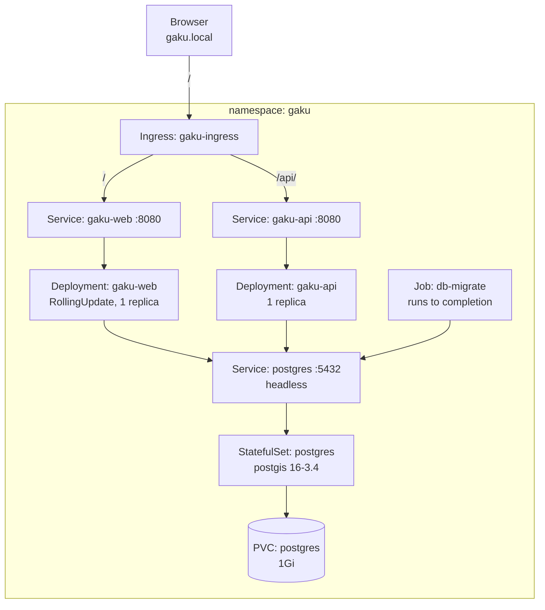

# Infrastructure - Local

Gaku runs on a single-node Kubernetes cluster and is deployed into a local minikube

| `infra/k8s/overlays/local/*` | k8s overlay for local env. |
| --- | --- |
| `infra/k8s/base/*` | Base k8s file for all env. |
| `infra/k8s/overlays/local/kustomization.yaml` | Key config for local setup. |
| `infra/k8s/k8s.mk` | Make targets. |


## 1. Topology



## 2. Environment variables

`.env.k8s` sits next to `kustomization.yaml` and holds four keys:

```
POSTGRES_DB=gaku
POSTGRES_USER=gaku
POSTGRES_PASSWORD=change-me
ConnectionStrings__DefaultConnection=Host=postgres;Port=5432;Database=gaku;Username=gaku;Password=change-me
```

## 3. Deploy

```bash
minikube start
minikube addons enable ingress
make docker_build               # api, web, migrator
minikube image load gaku-api:latest
minikube image load gaku-web:latest
minikube image load gaku-migrator:latest
make k8s_apply
make k8s_test
```

Add `echo "$(minikube ip) gaku.local" | sudo tee -a /etc/hosts` once, and the site answers at
http://gaku.local.

## 4. Verification

`make k8s_test` runs five layers, each printing a checklist, and works outward from "do the objects
exist" to "does traffic reach the app through the ingress":

| Target | Purpose |
| --- | --- |
| `k8s_test_layer1` | Did all k8s resources deployed? |
| `k8s_test_layer2` | Are the pods running and is `db-migrate` completed? |
| `k8s_test_layer3` | Do the in-cluster DNS and health checks work? |
| `k8s_test_layer4` | In-cluster TCP routing to postgres check. |
| `k8s_test_layer5` | Ingress External Routing check. |

## 5. Redeploy

`kubectl rollout restart` to force new pods onto the reloaded image.

`scripts/redeploy-web.sh` does the whole sequence for `Gaku.Web` and verifies each step:

```bash
./scripts/redeploy-web.sh
./scripts/redeploy-web.sh --dry-run
```


## 6. Known gaps

- No resource requests or limits. Nothing declares CPU or memory, so the scheduler cannot make
  informed decisions and nothing is protected from a noisy neighbour.
- Single replica everywhere.
- Secrets are plain Kubernetes Secrets, which are base64-encoded rather than encrypted at rest
  by default.
