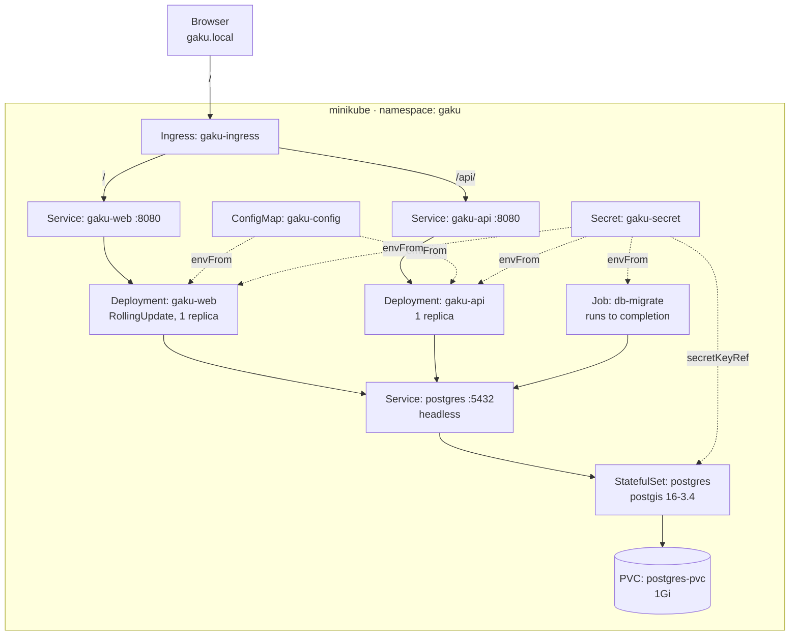

# Infrastructure

Gaku runs on a local single-node Kubernetes cluster (minikube), described entirely by the Kustomize
overlay in `infra/k8s/local/`. There is no cloud environment yet — [§7 Known gaps](#7-known-gaps)
covers what that implies.

Everything here is driven from the root `Makefile`, which includes `infra/k8s/k8s.mk`.

## 1. Topology



| Object | Kind | Notes |
| --- | --- | --- |
| `postgres` | StatefulSet | PostGIS 16-3.4, one replica, `pg_isready` readiness probe |
| `postgres` | Service | Headless (`clusterIP: None`) — resolves straight to the pod |
| `postgres-pvc` | PVC | 1Gi, `ReadWriteOnce`; survives `kubectl delete` of everything else |
| `db-migrate` | Job | Applies EF Core migrations, `restartPolicy: OnFailure` |
| `gaku-api` | Deployment | Readiness on `/api/health` |
| `gaku-web` | Deployment | `maxUnavailable: 0`, so a rollout never drops the site |
| `gaku-ingress` | Ingress | Host `gaku.local`; `/api/` → api, `/` → web |
| `gaku-config` | ConfigMap | `ASPNETCORE_ENVIRONMENT=Production` |
| `gaku-secret` | Secret | Generated from `.env.k8s` by Kustomize |

The web deployment's readiness probe is a bare `tcpSocket` check even though `Gaku.Web` serves
`/health`, so the pod reports ready as soon as Kestrel binds the port rather than when the app can
actually answer. Worth tightening if a rollout ever goes green ahead of the app.

## 2. Prerequisites

| Requirement | Why |
| --- | --- |
| minikube + kubectl | The cluster and its client |
| Docker | Images are built on the host, then loaded into minikube |
| `minikube addons enable ingress` | Nothing serves `gaku.local` without the ingress controller |
| `infra/k8s/local/.env.k8s` | Gitignored; the Kustomize secret generator reads it |
| `gaku.local` in `/etc/hosts` | Pointed at `minikube ip`, unless you use `curl --resolve` |

`.env.k8s` sits next to `kustomization.yaml` and holds four keys:

```
POSTGRES_DB=gaku
POSTGRES_USER=gaku
POSTGRES_PASSWORD=change-me
ConnectionStrings__DefaultConnection=Host=postgres;Port=5432;Database=gaku;Username=gaku;Password=change-me
```

The host is `postgres` — the in-cluster service name — not `localhost`. This is the difference
between `.env.k8s` and the root `.env`, which is written for tools running on the host.

## 3. First deploy

```bash
minikube start                  # or: make minikube_up
minikube addons enable ingress
make docker_build               # api, web, migrator
minikube image load gaku-api:latest
minikube image load gaku-web:latest
minikube image load gaku-migrator:latest
make k8s_apply                  # kubectl apply -k infra/k8s/local/
make k8s_test
```

Every workload sets `imagePullPolicy: Never`, so the cluster will never reach out to a registry —
an image that has not been loaded into minikube leaves the pod in `ErrImageNeverPull`. Building on
the host is not enough on its own; `minikube image load` is the step that matters.

Add `echo "$(minikube ip) gaku.local" | sudo tee -a /etc/hosts` once, and the site answers at
http://gaku.local.

## 4. Verification

`make k8s_test` runs five layers, each printing a checklist, and works outward from "do the objects
exist" to "does traffic reach the app through the ingress":

| Target | Question it answers |
| --- | --- |
| `k8s_test_layer1` | Do the secret, configmap, PVC, workloads and services exist? |
| `k8s_test_layer2` | Are the pods Running and is `db-migrate` Completed? |
| `k8s_test_layer3` | Do the in-cluster DNS names resolve and answer health checks? |
| `k8s_test_layer4` | Is TCP to `postgres:5432` open from the app pods? |
| `k8s_test_layer5` | Does `gaku.local` route to web and `gaku.local/api/` to the API? |

Run them individually when narrowing something down. The layer that fails first is the layer to
debug — a layer 5 failure with layers 1-4 green is an ingress problem, not an app problem.

`make k8s_postgres` opens a `psql` shell inside the postgres pod.

## 5. Redeploying one service

A code change needs the image rebuilt, reloaded, and the deployment restarted. Because every image
is tagged `latest` and pulled never, `kubectl apply` alone changes nothing — the pod spec is
identical, so Kubernetes has no reason to act. `kubectl rollout restart` is what forces new pods
onto the reloaded image.

`scripts/redeploy-web.sh` does the whole sequence for `Gaku.Web` and verifies each step:

```bash
./scripts/redeploy-web.sh
./scripts/redeploy-web.sh --dry-run   # print the commands, change nothing
```

## 6. Two things that surprise people

**Re-applying does not re-run the migration Job.** `db-migrate` is a `Job`, and a completed Job is
not re-run by `kubectl apply` — most of its spec is immutable, so applying an edited Job errors
rather than replacing it. To migrate again:

```bash
kubectl delete job db-migrate -n gaku
make k8s_apply
```

**Changing `.env.k8s` does not restart anything.** `kustomization.yaml` sets
`disableNameSuffixHash: true`, so `gaku-secret` keeps the same name whatever its contents. The
usual mechanism that rolls pods when a secret changes — a new secret name appearing in the pod spec
— is switched off. Apply, then restart by hand:

```bash
make k8s_apply
kubectl rollout restart deployment/gaku-api deployment/gaku-web -n gaku
```

## 7. Known gaps

- **Local only.** No cloud environment and no Terraform yet. The intended path — Terraform bootstrap,
  modules, then cloud Kustomize overlays — is planned in `docs/cicd-plan.md`, Stage 2.
- **No resource requests or limits.** Nothing declares CPU or memory, so the scheduler cannot make
  informed decisions and nothing is protected from a noisy neighbour.
- **Monitoring is scaffolding.** `infra/k8s/local/monitoring/grafana/` and `prometheus/` exist but
  are empty, and neither is referenced by `kustomization.yaml`.
- **Single replica everywhere.** Fine for local; the web deployment's rollout strategy is the only
  part already written for zero-downtime.
- **Secrets are plain Kubernetes Secrets**, which are base64-encoded rather than encrypted at rest
  by default. Acceptable on a local cluster, not beyond one.

## See Also

`infra/k8s/local/kustomization.yaml` — the entry point; every object is listed there
`infra/k8s/k8s.mk` — the make targets, including the full text of the five test layers
`docs/cicd-workflow-local-first.md` — how CI builds and delivers the images this cluster runs
`docs/cicd-plan.md` — phase-by-phase roadmap, including the cloud stage
