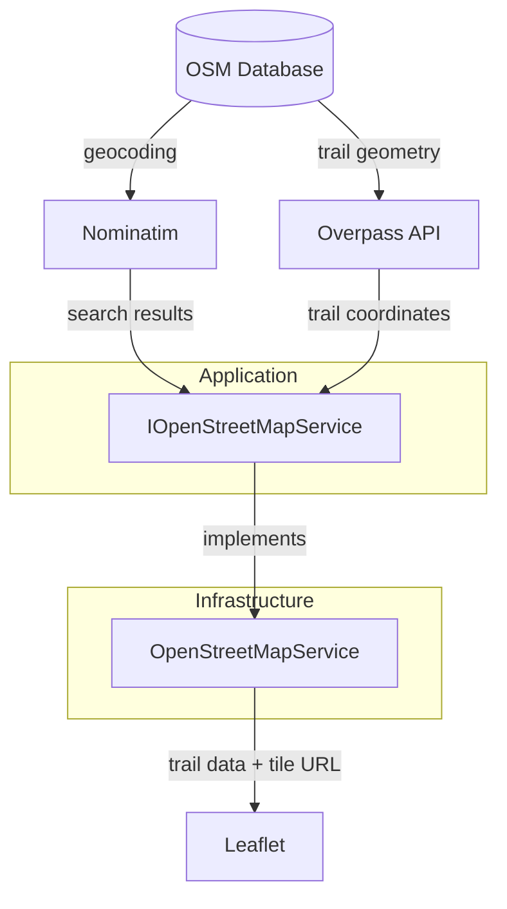

# OSM Integration Guide

## Overview

The OSM Database is the SSOT.
Nominatim provides geocoding (place name → coordinates)
Overpass provides spatial trail queries (bounding box → path geometry). 
Leaflet takes the trails and the geocoding and presents the complete picture to the end-user

---

## Nominatim — Location Search

Nominatim exposes a search endpoint that accepts a free-text query and returns matching places with their coordinates, bounding box, and display name. Gaku uses this to power location search, mapping each result to a `NominatimResult` domain record.

**OSM tag mapping:**

| Nominatim field | Domain field |
|---|---|
| `osm_id`, `osm_type` | `OsmId`, `OsmType` |
| `display_name` | `DisplayName` |
| `lat`, `lon` | `Location` |
| `boundingbox` | `Bounds` |
| `address.country` | `Country` |

**Rate limit:** Nominatim allows max 1 request/second. The current implementation does not enforce this — callers are responsible for debouncing. This is a known gap.

---

## Overpass API — Trail Data

Overpass API accepts an OverpassQL spatial query and returns all matching OSM ways and their constituent nodes within the requested bounding box. Gaku queries for two tagging conventions that OSM mappers use for hiking trails:

- Ways tagged `highway=path` or `highway=track` with a `sac_scale` grading
- Ways tagged `route=hiking`

The response is a flat list of nodes (each with coordinates) and ways (each referencing a list of node IDs). The service builds a node lookup by ID, then resolves each way's path from that lookup, discarding any trail with fewer than two resolved points.

**OSM tag mapping:**

| OSM tag | Domain field | Fallback |
|---|---|---|
| `name` | `Name` | `"Trail {id}"` |
| `surface` | `Surface` | none |
| `sac_scale` | `Difficulty` | none |
| node ID list | `Path` | missing nodes skipped |

---

## Error Handling

Both search and trail queries catch all exceptions, log the error, and return an empty list. The map loads regardless — users see no trails or no search results rather than an error page.

---

## Rate Limits & Policies

| Service | Policy |
|---|---|
| Nominatim | Max 1 req/sec; descriptive `User-Agent` header required |
| Overpass | Public instance; avoid sustained load; consider self-hosting for production |
| OSM tiles | Tile Usage Policy applies; `© OpenStreetMap contributors` attribution required |

OSM tile attribution is rendered by Leaflet on the map itself.

---

## See Also

`docs/architecture.md` - map load sequence diagram showing the full request flow
`src/Gaku.Application/Interfaces/IOpenStreetMapService.cs` - contract
`src/Gaku.Infrastructure/Services/OpenStreetMapService.cs` - implementation
`tests/Gaku.Infrastructure.Tests/Services/OpenStreetMapServiceTests.cs` - test