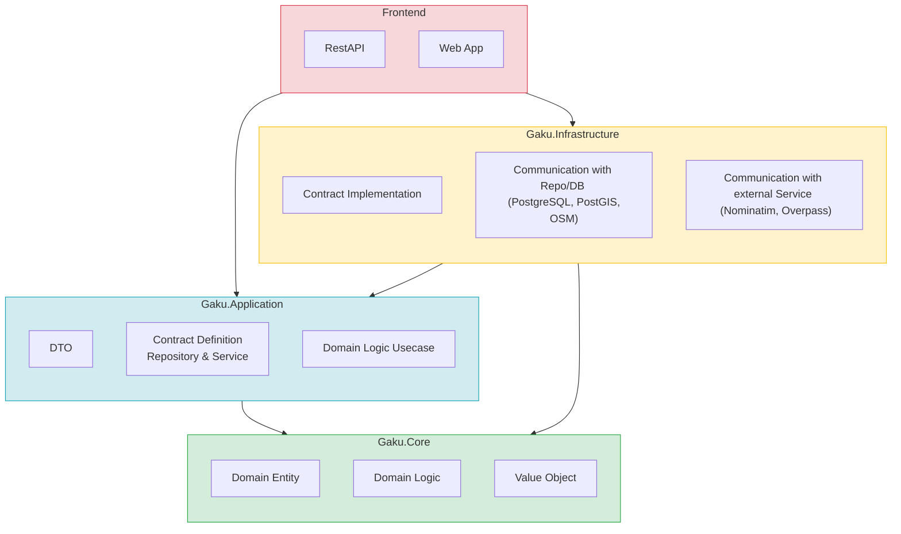
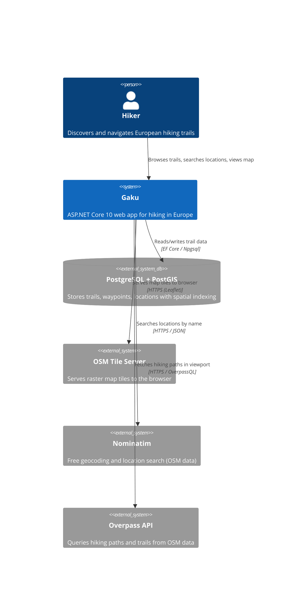
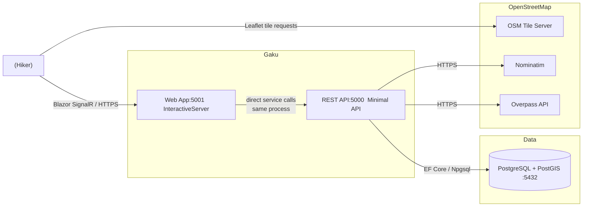
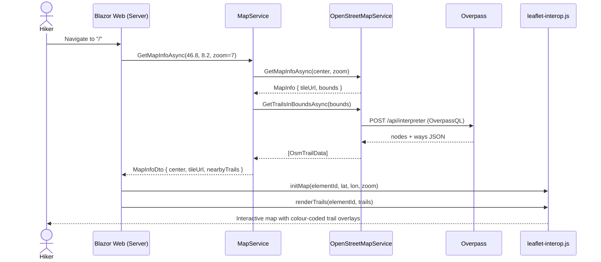

# Architecture

## Projects Overview

| Project | Layer | Responsibility |
|---|---|---|
| `Gaku.Web` | Presentation | Browser-facing UI. Renders interactive pages and map components.|
| `Gaku.Api` | Presentation | HTTP entry point. Exposes application use cases as REST endpoints. |
| `Gaku.Infrastructure` | Infrastructure | Fulfils the contracts defined by Application using real technology (database persistence, spatial queries, and external HTTP APIs). No business logic.|

## System Context - Gaku

---

## Containers — runtime components and communication

---

## Map Load Sequence — request flow when a hiker opens the map

