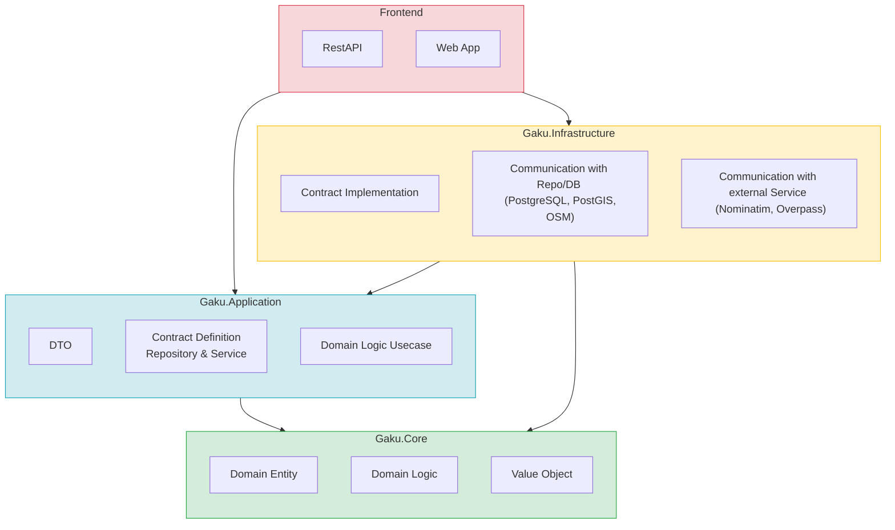
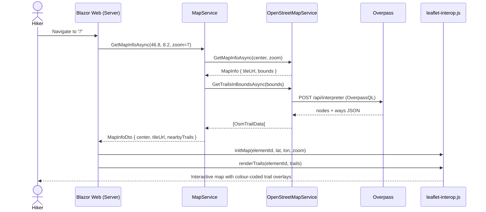

# Architecture

## Projects Overview

| Project | Layer | Responsibility |
|---|---|---|
| `Gaku.Web` | Presentation | Browser-facing UI. Renders interactive pages and map components.|
| `Gaku.Api` | Presentation | HTTP entry point. Exposes application use cases as REST endpoints. |
| `Gaku.Infrastructure` | Infrastructure | Fulfils the contracts defined by Application using real technology (database persistence, spatial queries, and external HTTP APIs). No business logic.|
| `Gaku.Application` | Application | Defines what the application can do (trail management and map exploration). Orchestrates domain logic to fulfil use cases and declares all contracts that Infrastructure must satisfy. |
| `Gaku.Domain` | Domain | Pure business model. Defines domain entities (`Trail`, `Waypoint`, `Location`), domain logic, value objects (`Coordinates`), and enums. No persistence or infrastructure concerns. |

---

## Map Load Sequence — request flow when a hiker opens the map

