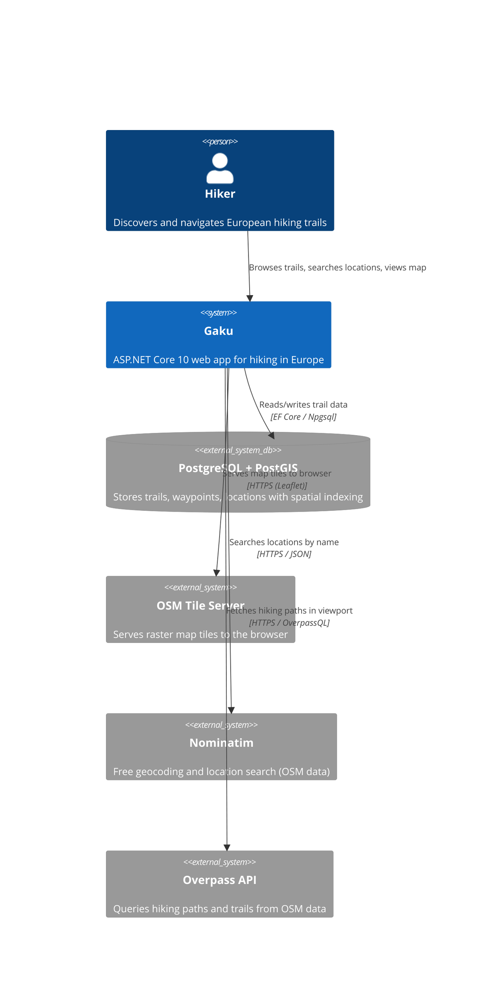
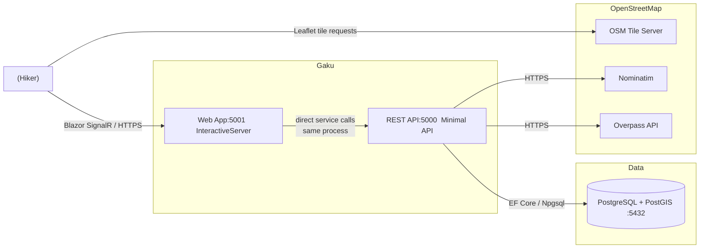

## System Context - Gaku

```mermaid
C4Context

  Person(hiker, "Hiker", "Discovers and navigates European hiking trails")
  System(gaku, "Gaku", "ASP.NET Core 10 web app for hiking in Europe")
  SystemDb_Ext(postgres, "PostgreSQL + PostGIS", "Stores trails, waypoints, locations with spatial indexing")
  System_Ext(osm_tiles, "OSM Tile Server", "Serves raster map tiles to the browser")
  System_Ext(nominatim, "Nominatim", "Free geocoding and location search (OSM data)")
  System_Ext(overpass, "Overpass API", "Queries hiking paths and trails from OSM data")

  Rel(hiker, gaku, "Browses trails, searches locations, views map")
  Rel(gaku, postgres, "Reads/writes trail data", "EF Core / Npgsql")
  Rel(gaku, nominatim, "Searches locations by name", "HTTPS / JSON")
  Rel(gaku, overpass, "Fetches hiking paths in viewport", "HTTPS / OverpassQL")
  Rel(gaku, osm_tiles, "Serves map tiles to browser", "HTTPS (Leaflet)")
```

---

## Containers — runtime components and communication

```mermaid
graph LR
  Browser["(Hiker)"]

  subgraph GakuSystem["Gaku"]
    Web["Web App:5001  InteractiveServer"]
    API["REST API:5000  Minimal API"]
  end

  subgraph Data["Data"]
    PG[("PostgreSQL + PostGIS :5432")]
  end

  subgraph OSM["OpenStreetMap"]
    Tiles["OSM Tile Server"]
    Nom["Nominatim"]
    Over["Overpass API"]
  end

  Browser -->|"Blazor SignalR / HTTPS"| Web
  Browser -->|"Leaflet tile requests"| Tiles
  Web -->|"direct service calls\nsame process"| API
  API -->|"EF Core / Npgsql"| PG
  API -->|"HTTPS"| Nom
  API -->|"HTTPS"| Over
```

---
